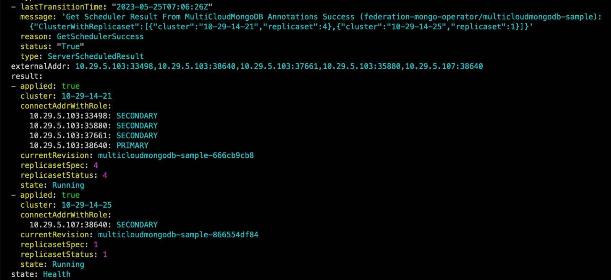

# FedState

FedState指的是Federation Stateful Service，主要的设计目标是为了解决在多云，多集群，多数据中心的场景下，有状态服务的编排，调度，部署和自动化运维等能力。

## 概述：

FedState对需要部署在多云环境上的中间件，数据库等有状态的服务通过Karmada下发到各个成员集群，使其正常工作的同时并提供一些高级运维能力。

## 架构：


组件说明：

- FedStateScheduler: 多云有状态服务调度器，在Karmada调度器的基础上，添加了一些与中间件服务相关的调度策略。
- FedState：多云有状态服务控制器主要负责按需配置各个管控集群与通过Karmada分发。
- Member Operator：一个概念，表示的是部署在管控平面的有状态服务Operator，FedState内置了Mongo Operator，后续会支持更多的有状态服务。
- FedStateCR：一个概念，表示多云有状态服务实例。
- FedStateCR-Member：一个概念，表示多云有状态服务被下发到管控平面的实例。

### FedState目前能力（以接入MongoDB Operator为例）：

- 多云MongoDB的增删改查。
- 多云MongoDB扩缩容。
- 多云MongoDB故障转移。
- 多云MongoDB配置更新，自定配置。
- 多云MongoDB资源更新。

## 快速开始：

部署FedState至Karmada Host集群，部署Member Operator至成员集群，在控制面创建FedStateCR，等待创建成功直到可以对外提供服务。

### 先决条件：

- Kubernetes v1.16+
- Karmada v1.4+
- 存储服务
- 集群VIP

### 环境准备及Karmada安装：

1. 准备不少于两个Kubernetes集群。
2. 使用Keepalived，HAProxy等服务分别管理两个集群的VIP。
3. 部署Karmada：[https://karmada.io/docs/installation/](https://karmada.io/docs/installation/)。

### FedState安装（以MongoDB为例）：

说明：

- Karmada Host：指的是部署Karmada组件的集群。
- Karmada Control：指的是与Karmada Apiserver交互的Karmada控制面。

1. （可选）在Karmada Host集群，检查所纳管的成员集群是否部署了estimator。


如果没有开启estimator，则调度器无法预估多云有状态服务资源设置能否被管控平面满足。

（可选）开启estimator，memberClusterName为想要开始estimator的成员集群名称：

```shell
karmadactl addons enable  karmada-scheduler-estimator  -C {memberClusterName}
```

（可选）检查estimator service的名称是否符合以 estimator-{clusterName} 为后缀。

2. 在Karmada Control上部署自定义资源解释器：

```other
kubectl apply -f customresourceinterpreter/pkg/deploy/customization.yaml
```

3. 在Karmada Host集群上部署控制面服务：

```other

kubectl create ns {your-namespace}

kubectl create secret generic kubeconfig --from-file=/root/.kube/config -n {your-namespace} 

## 在kubeconfig查看Karmada ApiServer名称

kubectl config get-contexts

## 修改manager.yaml将其中的KARMADA_CONTEXT_NAME值改为karmada apiserver名称

vim config/manager/manager.yaml

kubectl apply -f config/webhook/secret.yaml -n {your-namespace}

kubectl apply -k config/deploy_contorlplane/. -n {your-namespace}
```

4. 在Karmada Control上部署webhook以及控制面CRD：

```other
kubectl label cluster <成员cluster名称> vip=<成员集群对应的Vip>

kubectl apply -f config/webhook/external-svc.yaml

kubectl apply -f config/crd/bases/.
```

5. 在Karmada Host集群部署调度器：

```other
## 在kubeconfig查看Karmada Host Apiserver的名称以及Karmada Apiserver的名称和karmada Host的Vip地址

vim config/artifacts/deploy/deployment.yaml

## 修改以下启动参数为上面的值    

- --karmada-context=<karmada>

- --host-context=<10-29-14-21>

- --host-vip-address=<10.29.5.103>
```

6. 在member Cluster上部署数据面控制器：

```other
kubectl apply -f config/crd/bases/mongodbs.yaml -n {your-namespace}

kubectl apply -k config/deploy_dataplane/.
```

7. 在控制面部署MiddleCloudMongoDB：

```shell
kubectl apply -f config/sample/samples.yaml

## sample.yaml:
apiVersion: middleware.fedstate.io/v1alpha1
kind: MultiCloudMongoDB
metadata:
  name: multicloudmongodb-sample
spec:
  ## 副本数
  replicaset: 5
  ## 监控配置
  export:
    enable: false
  ## 资源配置
  resource:
    limits:
      cpu: "2"
      memory: 512Mi
    requests:
      cpu: "1"
      memory: 512Mi
  ## 存储配置
  storage:
    storageClass: managed-nfs-storage
    storageSize: 1Gi
  ## 镜像配置
  imageSetting:
    image: mongo:3.6
    imagePullPolicy: Always
```

8. 查看MultiCloudMongoDB状态以及各个被管控集群上MongoDB状态：



使用externalAddr地址连接MongoDB副本集。

